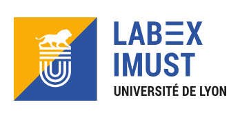
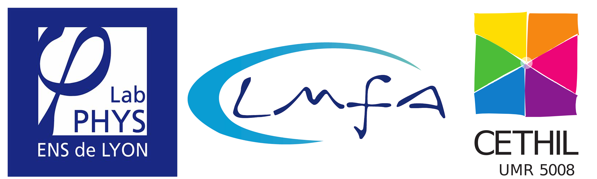

A propos
========

:date: 2021-02-21 14:42

PlumeX est une plateforme financée par le `Labex iMust <https://labeximust.universite-lyon.fr/>`_
de l'`Université de Lyon <https://www.universite-lyon.fr/>`_.

Partenaires du projet :

* **Francesca Chillà** `Laboratoire de Physique (UMR CNRS 5672) <http://www.ens-lyon.fr/PHYSIQUE/presentation>`_,  ENS de Lyon. Recherche : Convection thermique, Turbulence, Turbulence inhomogène, Structure cohérentes.

* **Sylvain Joubaud (PI)** `Laboratoire de Physique (UMR CNRS 5672) <http://www.ens-lyon.fr/PHYSIQUE/presentation>`_,  ENS de Lyon. Recherche : Ondes internes, Écoulements stratifiés, Milieux granulaires, Suspensions, Fluides complexes.

* **Hervé Pabiou** `CETHIL (UMR CNRS 5008) <https://cethil.insa-lyon.fr/>`_,  ENS de Lyon. Recherche : Convection naturelle ; Instabilités dans les écoulements ; Convection turbulente ; Transferts de chaleur par convection ; Application à l'intégration de capteurs solaires photovoltaïques-thermiques aux bâtiments en configuration double-peaux

* **Julien Salort** `Laboratoire de Physique (UMR CNRS 5672) <http://www.ens-lyon.fr/PHYSIQUE/presentation>`_,  ENS de Lyon. Recherche : Convection thermique turbulente, Ventilation naturelle, Microfabrication d'instruments pour les petites échelles de la turbulence, Turbulence de l'hélium superfluide

* **J John Soundar Jerome** `LMFA (UMR CNRS 5509) <https://lmfa.ec-lyon.fr/spip.php?article1&lang=fr>`_,  ENS de Lyon. Recherche : Interaction fluide/structure, Milieux granulaires denses, Suspensions, Écoulements diphasiques, Atomisation, Instabilités hydrodynamiques

